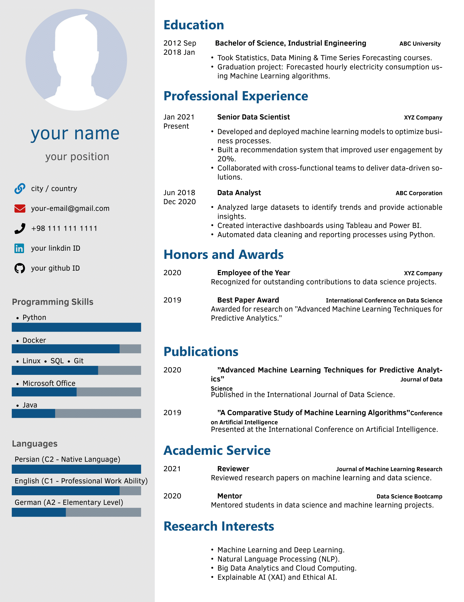

# LaTeX-Resume-Template

A clean and professional LaTeX template for creating resumes. Perfect for developers, researchers, and professionals.

## Features
- Modern and minimalist design.
- Easy to customize.
- Supports multiple sections (Education, Experience, Publications, etc.).
- Compatible with Overleaf and local LaTeX editors.

## How to Use
1. Clone this repository or download the ZIP file.
2. Open the `CV_template.tex` file in your LaTeX editor.
3. Replace the placeholder content with your own information.
4. Compile the document to generate your resume.

## Requirements
- A LaTeX editor (e.g., Overleaf, TeXShop, TeXworks).
- Basic knowledge of LaTeX.

## License
This project is licensed under the MIT License. Feel free to use and modify it for your needs.

## Contributing
Contributions are welcome! Please open an issue or submit a pull request.
